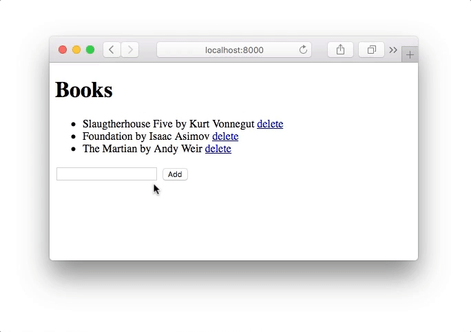

# Booklistapp with different technologies

Same simple web application done using different technologies.

I am using it as a teaching material to show how the same functionality can be
done using different technologies and demonstrating that each technology stack
is fit for different use case.

## Technologies

* [Good ol' plain PHP](php-plain)
* [PHP + Laravel](php-laravel)
* [Node.js + Express](nodejs-express)
* [Python + Django](python-django)

## The app

* list of books fetched from SQLite database
* link to delete any of the books
* text input and submit button for adding new book

Here's a simple screencast:



## SQLite database

All the apps use the same SQLite database file located at `/db.sqlite`. It is
not in this repo as it changes when apps writes to it. So when you clone
this repository, you should init the database by copying the defaults from
`/db.defaults.sqlite` to `/db.sqlite` using following command:

```bash
# In directory with repository booklistapp-with-different-tech
$ cp db.defaults.sqlite db.sqlite
```

It is SQLite version 3 database, so you can check the contents for example using
[SQLite Studio](https://sqlitestudio.pl/).

## License

ISC
